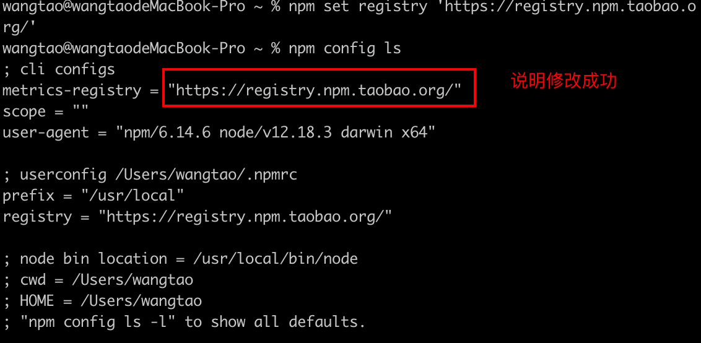
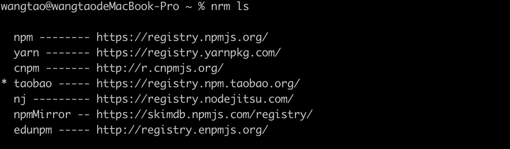
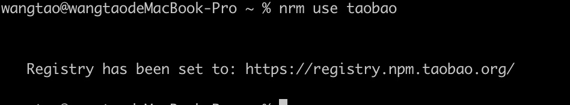

# nrm

## nrm的出现

nrm是一个npm源管理器，允许你快速在npm源之间进行切换，为什么会这样说那？npm默认情况下是使用了npm官方源（cmd输入npm config ls命令来查看：https://registry.npmjs.org/）。在国内使用这个源是不靠谱不稳定的。毕竟下载很慢动不动就会卡死，所以我们一般使用的是淘宝的镜像源：https://registry.npm.taobao.org/,接下来首先让我们来修改源，在cmd输入：

```bash
npm set registry 'https://registry.npm.taobao.org/'
```

然后在cmd输入：`npm config ls`查看是否修改源成功



这样，万一你在国外办公的时候或者想要切换成官方源，或者在公司有自己的私有npm源，就需要切换成公司的源，nrm就是这样出现的。

## nrm的操作

```bash
npm install -g nrm // 安装nrm
nrm ls // 查看可用源（带有*号的表示是当前源）
```



```bash
nrm current // 表示查看当前使用的源
```


```bash
nrm use <registry> // registry 为源的名字 比如切换taobao源
nrm use tabao // 切换为taobao源
```


```bash
nrm add <registry> <url> // registry 为源名 url为源的地址
// 比如添加自己公司的私有npm源，原地址例如：http://192.168.18.11:3000/repository/npm-public,源名为：company（任意取名称，作为自己公司的私有npm源的名称）


npm add company http://192.168.18.11:3000/repository/npm-public
// 出现add registry company success 表示添加成功
// 或者在cmd输入nrm ls看看company是否添加成功

nrm del <registry> // registry 为源名，删除某个源，比如刚刚添加的company
nrm del company // 出现delete registry company success表示删除成功

nrm test <registry> // 表示测试源的响应时间
nrm test taobao // 表示测试taobao源的响应时间
nrm test npm // 表示npm官方源的响应时间
```

### 补充

```bash
npm i cnpm -g --registry=https://registry.npm.taobao.org  //安装cnpm
// 最后的参数就是淘宝的镜像仓储url,并且cnpm是应用taobao源
cnpm -v  //查看版本号，并且证明安装成功
```


