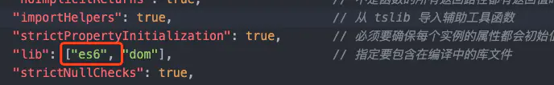

# 2:基础类型

## 布尔值
```ts
let isTrue:boolean = false;
```


## 数字

- ts中数字和js中一样，都是浮点数

```ts
let num:number = 1;
```


## 字符串

```ts
let str:string = 'abc';
```

- 还可以使用模板字符串

- ```ts
  let name: string = `Gene`;
  let age: number = 37;
  let sentence: string = `Hello, my name is ${ name }.
  
  I'll be ${ age + 1 } years old next month.`;
  ```


## 数组

数组有两种定义方式

- 在元素类型后面接上[]

  - ```ts
    let list: number[] = [1, 2, 3];
    ```

- 使用数组泛型`Array<元素类型>`

  - ```ts
    let list: Array<number> = [1, 2, 3];
    ```


## 元组 Tuple

**一个已知元素和数量的数组，并且各元素的数量不必相同**

```ts
// Declare a tuple type
let x: [string, number];
// Initialize it
x = ['hello', 10]; // OK
// Initialize it incorrectly
x = [10, 'hello']; // Error
```

向元组中增加数据，只能增加元祖中存在的数据。

```ts
let tuple:[string,number,boolean] = ['zf',10,true];
tuple.push('回龙观');
```


## 空值 void

表示没有任何类型，一般使用在一个没有返回值的函数

```ts
function warin():void{
    alert('This is my warning message')
};
// 只有null和undefined可以赋值给void
// 开始strickNullChecks的话，只能讲undefined赋值给void
```


## Null和undefined

和void相似，null和undefined是单独的两种类型，他们本身用处不大，默认情况下，null和undefined是所有类型的子类型（也就是例如你可以将null赋值给一个number类型的变量）

但是一般在项目中开启`strictNullChecks`检测，也就是null和undefined只能赋值给他们自身还有any（其实还有void=》开启了strickNullChecks的话只有undefined可以赋值给void；

- 严格模式
  - null=》可以赋值给null，any
  - undefined=》可以赋值给undefined，any，void
- 非严格模式
  - null=》可以赋值给null，undefined，any，void还有string，number等类型
  - undefined=》可以赋值给null，undefined，any，void还有string，number等类型


## Symbol

**注意**：我们在使用 `Symbol` 的时候，必须添加 `es6` 的编译辅助库,如下：



## BigInt

在ts3.2中内置，可以安全的存储和操作大整数，即使这个数字已经超过了js安全整数范围

2^53 - 1

```ts
let a:bigint = Bigint(1);
```


## never类型

never类型是永不存在类型的值，是其他所有类型的子类型，但是没有类型是never的子类型，或者可以赋值给never，即使是any也不行

有三种情况是never类型

1. 错误
2. 死循环
3. 类型判断时会出现never

## 类型推导

- 声明变量没有赋值时默认变量是any类型

  - ```ts
    let name;//类型为any
    name = 'name';
    name = 10
    ```

- 声明变量赋值时，则以赋值的变量为准

  - ```ts
    let name = 'name';//name会被推导为字符串类型
    name = 10; // 报错：不能将类型number赋值给类型string
    ```