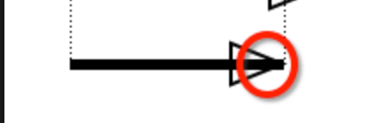

## arrowLink

``new FastV.ArrowLink(nodeA, nodeB, config)``

#### 参数

| 参数名     | 描述   | 是否必填 | 例子                                                         |
| ---------- | ------ | -------- | ------------------------------------------------------------ |
| **nodeA**  | 起点   | 必填     | {x:100,y:100,width:10,height:10}                             |
| **nodeB**  | 终点   | 必填     | {x:100,y:100,width:10,height:10}                             |
| **config** | 配置项 | 非必填   | **color**： 箭头线颜色                                       |
|            |        |          | **direction**：箭头朝向（默认：forward，起点指向重点）forward/backward/both |
|            |        |          | **lineWidth**：箭头线粗细（单位px）                          |
|            |        |          | **dashed**：是否为虚线（true：是，false/默认：否）           |
|            |        |          | **text**：箭头线上文本                                       |
|            |        |          | **fontSize**：文本字体大小（默认：12px）                     |
|            |        |          | **fontFamily**：文本的字体（默认：serif）                    |
|            |        |          | **fontColor**：文本颜色（默认：#000）                        |
|            |        |          | **textAlign**：文本左右对齐方式（默认：center）left/right/center |
|            |        |          | **textBaseline**：文本的基准线（默认：middle）top/bottom/middle |
|            |        |          | **arrowLen**：箭头的长度（默认：10）                         |
|            |        |          | **arrowWidth**：箭头的宽度（默认：5）                        |
|            |        |          | **arrowAngle**：箭头和线之间夹角（默认：45）                 |

- 首先，传入起始点坐标，canvas translate到起点坐标位置，计算线段相对于x轴旋转角度，旋转整个canvas画布，然后lineto线段的长度来画线段
  - （为什么不直接画，而是translate到起点然后旋转一定角度？）
  - 因为如果有箭头的话，并且linewidth不是默认，那么会造成如图问题
  - 
  - 所以如果有右箭头，画线时候缩短箭头宽度的长度，这样旋转canvas画布之后，可以直接`lineTo(线段长 - 箭头宽, 0)`，有左键头可以`moveTo(箭头宽, 0)`，然后`lineTo(线段长, 0)`，如果由两侧箭头则结合以上两种
- 然后根据传入的config参数来判断是需要画起始点箭头还是终止点箭头或者两者都画，箭头方法略

#### 箭头线的拾取方案

- 首先获取到canvas中出发点击事件的测试点x和y

- 计算测试点和起点连线与线段的点积--cross

  - 小于0？说明测试点的垂直线在起点侧延长线上，直接计算测试点与起点两点之间距离

- 计算线段自身的点积（也就是线段长度的两倍）--lengthSquare

  - 如果cross比lengthSquare还要大，说明测试点到线段的垂线在终点侧延长线上，计算测试点和终点之间的距离

- 以上两种情况都不满足？

  - 说明测试点到线段的垂直线在线段中间，可以直接计算线到直线的距离

- **除了以上方案还有另外一种：使用离屏canvas，并且给每个图形增加为一个rgba颜色，通过点击坐标获取颜色来判断**

  - 不过离屏canvas获取颜色方案貌似并不适合path，因为canvas获取到的颜色稍有误差

  **（暂时没想到第三种方案，或者对上面两种的优化策略）**

## LoopLink

环形线，从当前node指向自身的线

`new FastV.LoopLink(nodeA,config)`

#### 参数

| 参数名 | 描述       | 是否必填 | 例子                                                   |
| ------ | ---------- | -------- | ------------------------------------------------------ |
| nodeA  | 起始点     | 是       | {x:100,y:100,width:10,height:10}                       |
| config | 可选配置项 | 否       | **color:** 线颜色 ，默认#000                           |
|        |            |          | **direction：**箭头朝向，默认forward，forward/backward |
|        |            |          | 其他暂略，可以参考arrowlink                            |

- 首先，传入起点坐标，因为looplink采用了二阶贝塞尔曲线，所以需要控制点和终点坐标
- 现方案为，通过起始点坐标和点的宽高，简单的讲终点坐标设置为`起始点x+width`,y坐标同理，`起始点y+height`
- 控制点简单设置为，`x = (起始点x * 2 + width)/2`, `y = (起始点y - height * 5)`,有待修改，确定控制点相对位置，或者需要用户传入？传入坐标或者直接传入一个相对的distance？
- 根据传入direction，也就是箭头朝向，来画箭头，forward？说明箭头由起点指向终点，将箭头方向设置为，控制点指向终点，backward则是控制点指向起点

#### looplink的拾取方案

- 由于点到曲线距离需要求三次方程，计算起来很难实现，所以采用了切割法（我自己命名，就是取线上均匀分布的尽可能多的点）

- 将曲线切割为一个个在曲线上的点，尽可能的多切分，然后计算点击点和曲线上各个点之间的距离
- looplink切分的份数，根据曲线的长度增加而增加
- **考虑到切割法还是有一定误差，尝试使用了离屏canvas的方法，发现还是有误差，暂时没想到第三种方案**
